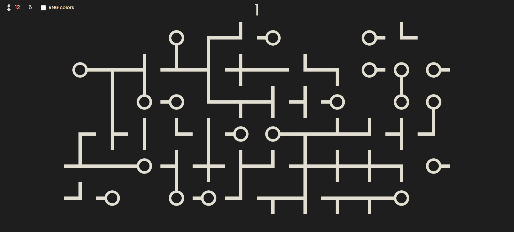
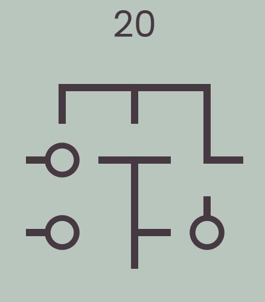

# JSPipes

Pipe connection game with procedural generation written in JavaScript, inspired by this [game](https://play.google.com/store/apps/details?id=com.balysv.loop&hl=en). The procedural generation is done using a simple hashing algorithm - [MurmurHash3](https://en.wikipedia.org/wiki/MurmurHash).

- Ability to change the field size

- Ability to randomize colors

